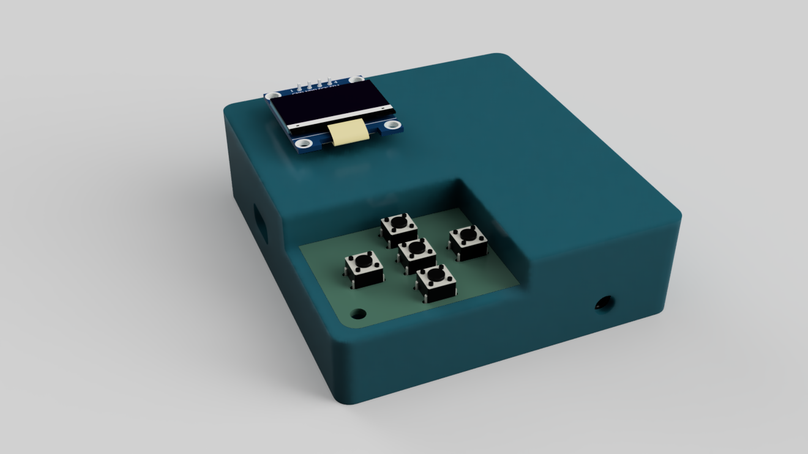
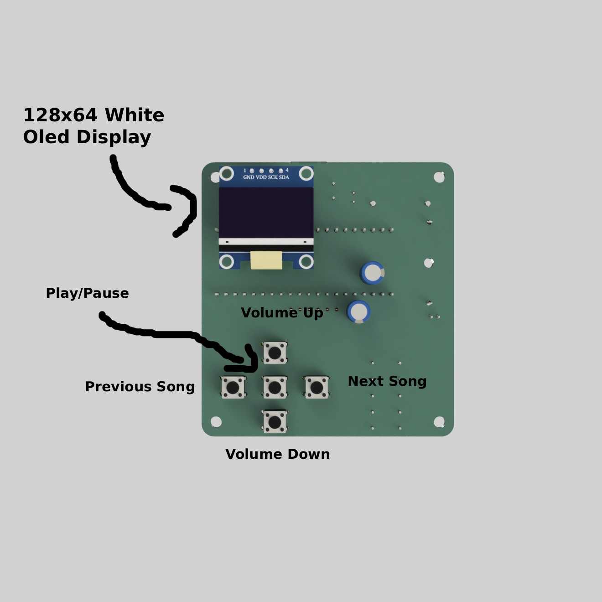
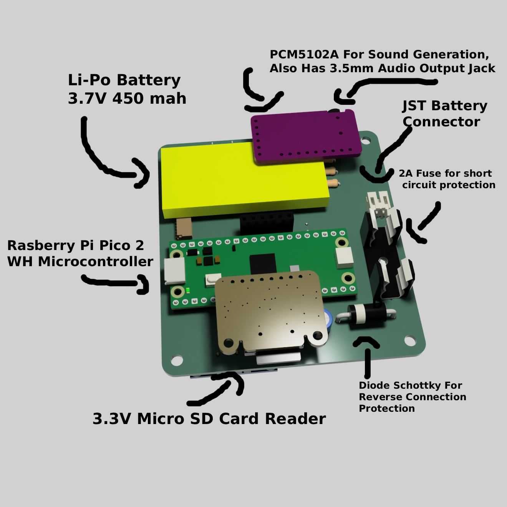
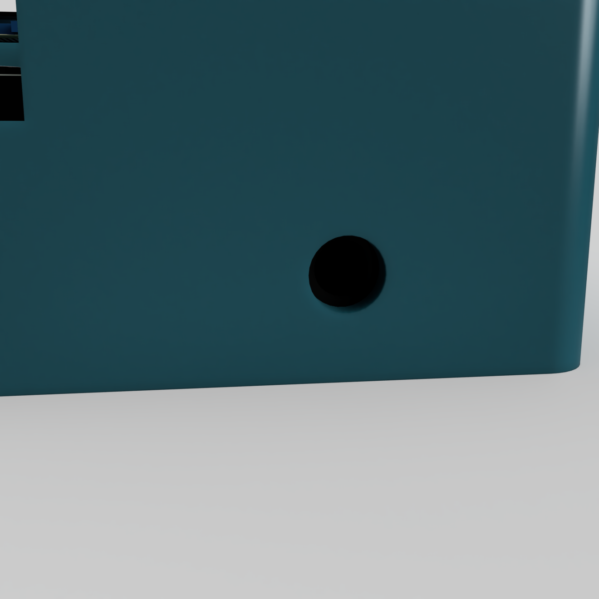
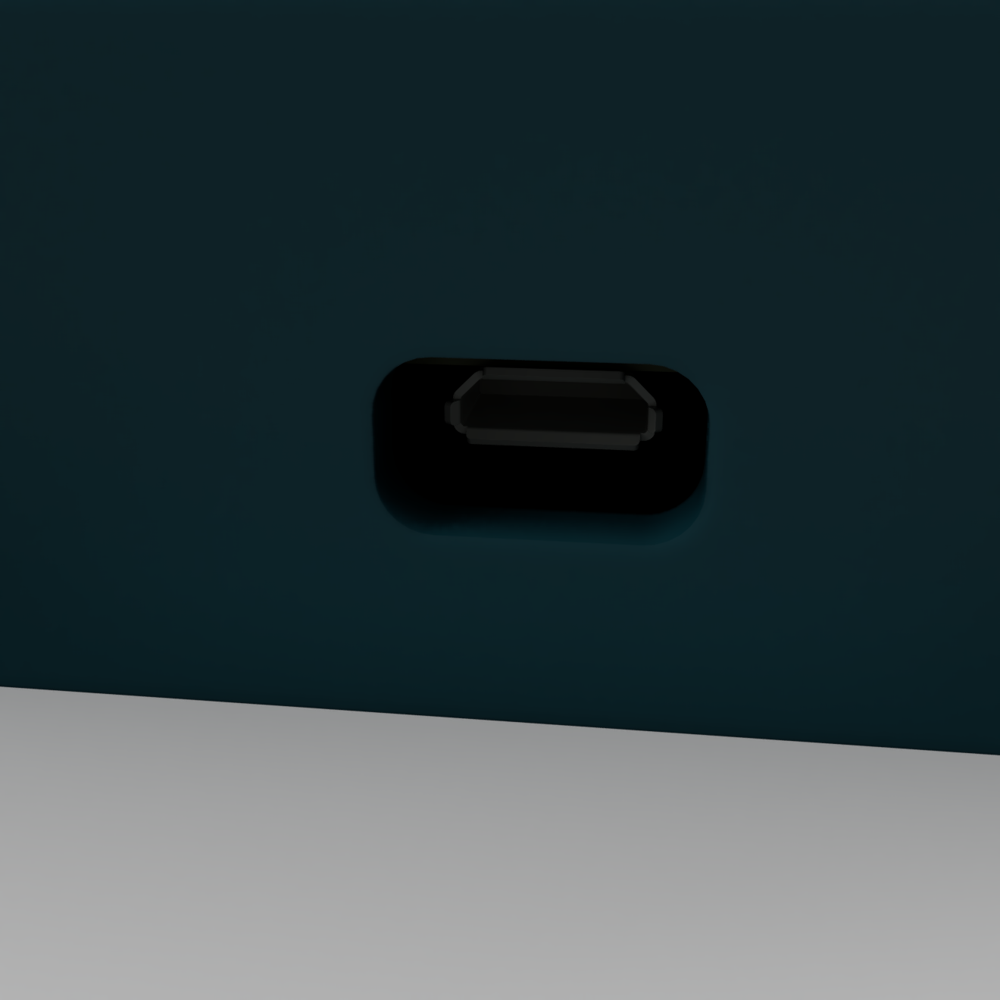

  

# MP3-Player

## What is it?
MP3-Player is a DYI project made by me. It can:
- Play songs from a microSD card directly to your earphones.
- Stay on battery for multiple hours.
- Show you info about battery charge and info about song (time, song name, playing/not playing, etc.).
- Be controlled with 5 buttons.

## Why?
I like listening to music and making my own hardware/software projects, and i also wanted to learn more about how these things are made, so i chose to make one myself. 

## How to use?
1. Solder all the components to the custom PCB board.
2. 3D print the case and the battery hatch.
3. Screw the PCB securely into the case.
4. Download the firmware and flash it using the Arduino IDE.
5. Format a microSD card, add your `.mp3` or `.wav` songs directly to the root directory, and plug it into the reader.
6. Connect your charged Li-Po battery and you can now listen to your songs.

## Software
I wrote the main firmware in arduino ide c++. To flash the board, you must install arduino ide and the libraries i am using. Then connect the micro usb cable to the mcu, and flash the code. The code handles all the communications between the modules, plays the song to the PCM5102A and creates the ui, checks for buttons, checks battery etc.

## Electronics

I used a custom PCB, which takes power from a 3.7 Li-Po 450 mah (the battery should last for few hours) and passes it through a fast fuse for short circuit protection and diode for reverse connection protection. Then it goes to the rasberry pi pico 2 WH, which converts the power to stable 3.3V. The MCU reads the micro sd card reader module through spi, and then plays the song into the PCM5102A. It also displays all the info to the oled screen, and checks the five buttons for input. The five buttons have these features:
- Volume Down
- Volume Up
- Previous Song
- Next Song
- Play/Pause

  

## Features
- ### Has a 3.5mm audio jack output, you can connect your earphones to it and listen directly.

  

- ### Has a micro SD card reader, put the micro SD card inside and listen to your songs.

  

- ### Has a micro USB port, so you can flash your own firmware or debug software issues.

  

# Bill of Materials (BOM)

| Item Name | Qty | Price (total) (USD) | Item Link | Notes |
|---|---|---|---|---|
| Resistor 10k | 5 | $0.24 | [Link](https://dratek.cz/arduino-platforma/7650-rezistor-10k-0.25-w-1.html) | Resistors for buttons, so that the circuit works |
| Button | 5 | $0.47 | [Link](https://dratek.cz/arduino-platforma/176310-mikrospinac-tlacitko-6-x-6-x-8-mm.html) | The buttons, used for skipping songs, changing volume, pausing, etc. |
| GY-PCM5102 I2S audio module | 1 | $4.61 | [Link](https://www.laskakit.cz/gy-pcm5102-i2s-audio-modul/) | The audio generator, changes digital sound to analog |
| 3.3V micro SD card module | 1 | $3.20 | [Link](https://www.laskakit.cz/laskakit-microsd-card-modul/) | Micro SD card reader, reads the micro SD card |
| OLED display 128x64 white | 1 | $7.86 | [Link](https://dratek.cz/arduino-platforma/3181-iic-i2c-oled-1-3-displej-128x64-bily.html) | OLED display, shows the user data like volume, info about songs, battery percent etc. |
| Resistor 100k | 1 | $0.05 | [Link](https://dratek.cz/arduino-platforma/7653-rezistor-100k-0.25-w-1.html) | Resistor for voltage divider, which steps down the voltage so the ADC can read it |
| Resistor 330k | 1 | $0.05 | [Link](https://dratek.cz/arduino-platforma/174965-metalizovany-rezistor-330k-0-25w-1.html) | Resistor for voltage divider, which steps down the voltage so the ADC can read it |
| Condensator 100µF 50V | 4 | $0.20 | [Link](https://dratek.cz/arduino-platforma/7825-kondenzator-100uf-50v.html) | Condensators, smooths the voltage and evens out current spikes |
| Fuse Fast 250V 2A | 10 | $0.19 | [Link](https://www.tme.eu/cz/details/zks-2a/pojistky-5x20mm-rychle/eska/520-620/) | Fast fuses — if there is a short circuit, the fuses blow and disconnect the battery from the circuit, protecting the battery and the person |
| Diode Schottky; THT; 40V; 3A; DO201AD; Ufmax: 0.475V | 2 | $0.64 | [Link](https://www.tme.eu/cz/details/1n5822-st/diody-schottky-tht/stmicroelectronics/1n5822/) | Diode, prevents opposite polarity battery connections |
| Dupont female pins | 1 | $0.33 | [Link](https://dratek.cz/arduino-platforma/913-dupont-dutinkova-lista-samice-samec.html?cv) | Used for plugging in the OLED display and other things |
| Dupont male pins | 1 | $0.15 | [Link](https://dratek.cz/arduino-platforma/1331-dupont-40pin-2-54-mm-kolikova-lista-rovna.html) | Same as above, but male version |
| JST 6-pin connector | 2 | $1.49 | [Link](https://www.tme.eu/cz/katalog/signalove-konektory-raster-1-00mm_112946/?queryPhrase=SM06B&keywordSetName=extended) | SMD JST 6-pin connector, connects the micro SD card reader to the main PCB |
| JST 6-pin cable | 2 | $1.41 | [Link](https://dratek.cz/arduino-platforma/122186-jst-sh-1.0mm-6-pin-vodic-samice.html) | The cable for the SMD JST connector |
| Schurter fuse holder 10A 20x5mm | 2 | $2.28 | [Link](https://www.tme.eu/cz/details/0031.8211/pojistkova-pouzdra-do-pcb/schurter/) | Fuse holder — holds the fuse so it can be replaced when blown, no desoldering needed |
| JST battery terminal | 3 | $0.93 | [Link](https://www.tme.eu/cz/details/s2b-ph-k-s/signalove-konektory-raster-2-00mm/jst/s2b-ph-k-s-lf-sn/) | Battery terminal — the battery connects to it and distributes the power |
| Raspberry Pi Pico 2 WH | 1 | $9.71 | [Link](https://www.tme.eu/cz/details/sc1634/raspberry-pi-vestavene-systemy/raspberry-pi/raspberry-pi-pico-2-wh/) | The main brain of the system — reads the micro SD card, runs the UI menu, sends the sound output to the sound chip |
| Li-Po battery 3.7V 450mAh | 1 | $5.90 | [Link](https://dratek.cz/arduino-platforma/179445-lipol-baterie-502248-450mah-3-7v.html) | Shipping to Czech Republic |
| JLCPCB PCB | 5 | $3.20 | [Link](https://cart.jlcpcb.com/quote?stencilLayer=2&stencilWidth=100&stencilLength=100&stencilCounts=5&plateType=1&spm=Jlcpcb.Homepage.1010) | Shipping to Czech Republic |
| Shipping — Dratek.cz | 1 | $4.00 | [Link](https://www.dratek.cz) | Shipping to Czech Republic |
| Shipping — TME.eu | 1 | $8.47 | [Link](https://www.tme.eu/) | |
| Shipping — LaskaKit | 1 | $3.76 | [Link](https://www.laskakit.cz) | |
| Shipping — JLCPCB | 1 | $12.00 | [Link](https://jlcpcb.com/) | |
| **Total Price (USD)** | | **$65.82** | | |
